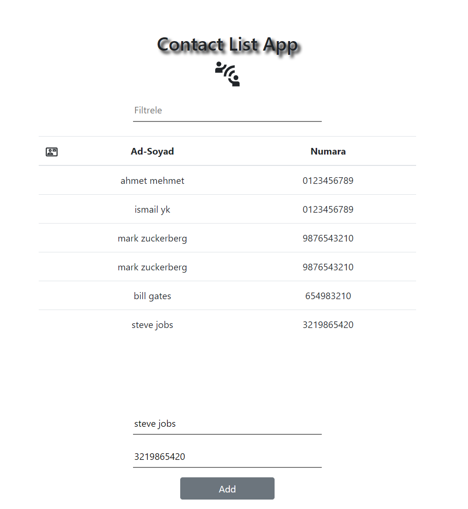

## React ile formlarla rehber arayüzü oluşturma

projeyi indirdikten sonra node_module klasörünü indirmek için terminale
```javascript
npm install create-creat-app
```
yazıp indirme işlemini yapınız. Daha sonra react_rehber_main klasöründe değilseniz 
```javascript
cd react_rehber_main
```
yazarak projenin olduğu dosyaya gidip 
```javascript
npm start
```
yazıp projeyi başlatabilirsiniz.

proje çalışmaktadır tabloya isim ,soyisim, telefon numarası, yazdıktan sonra tabloda gösterilecektir 

projeye ekleme yaptıktan sonra filtreleme yapılabilecektir


